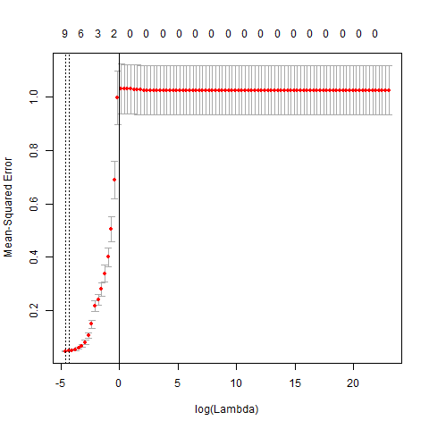

# Abstract

This project is largely based on Chapter 6 of **Linear Model Selection and Regularization** (From "An Introduction to Statistical Learning" by James et al.). The primary idea of this project is to perform a predictive modeling process applied on the data set Credit. We will be considering *Ridge Regression (RR)*, *Lasso Regression (LR)*, *Principal Components Regression (PCR)*, and *Partial Least Squares Regression (PLSR)*, and training them using cross-validation. We evaluate the best model by their Minium Square Errors on the test sets.


---
title: "Introduction"
author: "Liang Hao, Andrew Shibata"
date: "11/3/2016"
output: pdf_document
---

# Introduction
The primary idea of this project is to perform a predictive modeling process applied on the data set Credit. We will be considering *Ridge Regression (RR)*, *Lasso Regression (LR)*, *Principal Components Regression (PCR)*, and *Partial Least Squares REgression (PLSR)*, and training them using 10-fold cross-validation. We evaluate the best model by their Minium Square Errors on the test sets.


---
title: "Data"
author: "Liang Hao, Andrew Shibata"
date: "11/3/2016"
output: pdf_document
---
```{r,echo=FALSE, message=FALSE}
# Settings
options(xtable.comment = FALSE)
options(knitr.comment = FALSE)
```

# Data

## Description
The *Credit* data set contains information about 400 bank customers. It has eleven columns in total, six of which are quantitative, including:

* *Income*, the customer's stated income,
* *Limit*, the customer's credit limit, 
* *Rating*, the customer's credit rating,
* *Cards*, the number cards that the customer has, 
* *Age*, the age of the customer, 
* *Education*, the year of education that the customer has; 

four of which are qualitative, including:

* *Gender*, the gender of the customer, with two levels: *Male* or *Female* 
* *Student*, whether the customer is currently a student, with two levels: *Yes* or *No* 
* *Married*, the marital status of the customer, with two levels: *Single* or *Married*,
* *Ethnicity*, the ethnicity of the customer, with three levels: *Caucasian*, *African American* and *Asian*; 

and a dependent quantitative variable *Balance*, describing the current balance of the customer in his or her bank account.


In this report, we focus on choosing the independent variables that helps to predict the dependent variables, and choosing the best models with the optimal parameters.

## Exploratory Data Analysis
We may first run some preliminary analysis on each of these variables.

### Quantitative Variables

```{r, echo=FALSE, results='asis', message=FALSE}
library(xtable)
load('../data/eda-summaryMatrix.RData')
xtable(summaryMatrix, caption = 'Summary Statistics for Quantitative Variables')
```

The distribution of the variables might not be necessarily clear. We may also have a look at the histograms:

#### Income:
```{r, out.width = "150px", echo=FALSE,message=FALSE, fig.align ='center', eval = T, split=TRUE}
knitr::include_graphics("../images/histogram-income.png")
```

We can see that *Income* has a skewed-to-the-right distribution, with a peak of distribution at around 25 unit, which also explains why its mean of 45.22 is quite larger than its median 33.12.

#### Limit:
```{r, out.width = "150px", echo=FALSE,message=FALSE, fig.align ='center', eval = T, split=TRUE}

```

We see that *Rating* basically follows a normal distribution, with the majority of the data in range between 1000 and 8000. We can also see that the median 4622 is relatively close to its mean 4735.

#### Rating:
```{r, out.width = "150px", echo=FALSE,message=FALSE, fig.align ='center', eval = T, split=TRUE}

```

We see that *Rating* basically follows a normal distribution with a long right tail. Most of the data lie in the range between 300 and 600. Also, its median 344 is relatively close to its mean of 355.

#### Cards:
```{r, out.width = "150px", echo=FALSE,message=FALSE, fig.align ='center', eval = T, split=TRUE}

```

We see that *Cards* follows a skewed to the right distribution, with a peak of distribution between 0 and 2. Because the range of this variable, 8, is relatively small, we may consider scaling for future analysis.

#### Age:
```{r, out.width = "150px", echo=FALSE,message=FALSE, fig.align ='center', eval = T, split=TRUE}

```

We may see that *Age* has two peaks, at 40-50 and 60-70 years old, which can also be infereced by the fact that both of its median 56 and its mean 55 are not in the peak ranges.

#### Education:
```{r, out.width = "150px", echo=FALSE,message=FALSE, fig.align ='center', eval = T, split=TRUE}

```

We may see that *Education* has a skewed-to-the-left distribution, with a peak at 15 years, saying that most people have years of education upto undergraduate levels. We may also see this trend from the fact that its median 14 is slightly greater than its mean of 13.5.

#### Balance:
```{r, out.width = "150px", echo=FALSE,message=FALSE, fig.align ='center', eval = T, split=TRUE}

```

For the dependent variable *Balance*, we may see that the distribution has a long right tail, with a peak between 0 and 250 units. Such a trend can also be inferenced from the fact that its meidan 459.5 is quite smaller than its mean of 520.

Furthermore, we may also have a look at the correlation between the variables:
```{r,echo=FALSE, results='asis'}
load('../data/correlation-matrix.RData')
xtable(correlationMatrix, caption = 'Correlation matrix for the Quantitative Variables')
```

Additionally the plot of correlations:

```{r,echo=FALSE, out.width='400px',fig.align='center'}

```


#### Conclusion:
We may see that *Income* has a somewhat strong and positive correlation with *Balance*, and strong correlation with *Limit* and *Rating*; *Limit* has a strong positive correlation with *Balance*, and one-to-one correlation with *Rating*; *Rating* has a strong positive correlation with *Balance*; and *Cards*, *Age* and *Education* have small or even no correlation with *Balance*.

Therefore, for future analysis, we may consider using *Income* and *Limit* as two major predictors, for other independent variables are either dependent on these two, or unlikely to have much predicting power for the dependent variable *Balance*.

Also, we may want to normalize and standardize the data set for the range and scale of the raw data may have an impact on how our model would perform.

### Qualitative Variables:

#### Gender:
```{r, out.width = "150px", echo=FALSE,message=FALSE, fig.align ='center', eval = T, split=TRUE, results='asis'}
knitr::include_graphics("../images/barchart-gender.png")
load('../data/frequencyTable-gender.RData')
xtable(genderTable, caption = 'Frequency Table for Gender')
```

We may see that the two levels *Male* and *Female* basically have the same amount of input in this data set. Additionally, we may have a look at the boxplot os *Balance* conditioned on the two levels of *Gender*:
```{r, out.width = "150px", echo=FALSE,message=FALSE, fig.align ='center', eval = T, split=TRUE}

```

We may see that the two boxes seem quite similar to each other, which may indicate that *Gender* might not have a strong correlation with *Balance*.

#### Student:
```{r, out.width = "150px", echo=FALSE,message=FALSE, fig.align ='center', eval = T, split=TRUE,results='asis'}

load('../data/frequencyTable-student.RData')
xtable(studentTable, caption = 'Frequency Table for Student')
```

We may see that majority input of the data set are not students. Additionally, we may have a look at the boxplot os *Balance* conditioned on the two levels of *Student*:
```{r, out.width = "150px", echo=FALSE,message=FALSE, fig.align ='center', eval = T, split=TRUE}

```

We may see that the *Balance* of *Students* look much higher than those of *Non-Students*, which may indicate that *Student* may be a good predictor for the *Balance*. We may keep this in mind for future analysis.

#### Married:
```{r, out.width = "150px", echo=FALSE,message=FALSE, fig.align ='center', eval = T, split=TRUE, results='asis'}

load('../data/frequencyTable-married.RData')
xtable(marriedTable, caption = 'Frequency Table for Marital Status')
```

We may see that more married customers are in the data set than single ones. Additionally, we may have a look at the boxplot os *Balance* conditioned on the two levels of *Married*:
```{r, out.width = "150px", echo=FALSE,message=FALSE, fig.align ='center', eval = T, split=TRUE}

```

We can see that the two boxplots have basically the same distribution, with may indicate that the *Balance* might not depend on *Married*.

#### Ethnicity:
```{r, out.width = "150px", echo=FALSE,message=FALSE, fig.align ='center', eval = T, split=TRUE, results='asis'}

load('../data/frequencyTable-ethnicity.RData')
xtable(ethnicityTable, caption = 'Frequency Table for Ethnicity')
```

We may see that *Caucasian* takes about half in the ethnicity of the customers, and *African American* and *Asian* take the other half combined. Additionally, we may have a look at the boxplot os *Balance* conditioned on the three levels of *Ethnicity*:
```{r, out.width = "150px", echo=FALSE,message=FALSE, fig.align ='center', eval = T, split=TRUE}

```

We may see that the *Balance* distribution of the three ethnicities are basically the same, meaning that *Balance* might not depend on the *Ethnicity* of the customers.

#### Conclusion:
With the analysis above, we may consider using *Student* as a predictor, for *Balance* are quite different for the two levels. For other variables, we may want to figure out with future analysis.


---
title: "Method"
author: "Liang Hao, Andrew Shibata"
date: "11/3/2016"
output: pdf_document
---
```{r,echo=FALSE, message=FALSE}
# Settings
options(xtable.comment = FALSE)
options(knitr.comment = FALSE)
```

# Method
The methods that we are evaluating for this project include two Shrinkage Methods, *Ridge Regression* and *Lasso Regression*, and two Dimension Reduction Methods, *Principal Components Regression* and *Partial Least Squares Regression.* We also have the *Ordinary Least Squares Regression* as the benchmark to compare the models.

### Ordinary Least Squares Regression (OLS)
Ordinary Least Squares Regression is a method for estiamting the unknow parameters in a linear regression model, with the goal of minimizing the sum of the squares of the differences between the observed responses in the given dataset and those predicted by a linear function of a set of explanatory variables. In particular, the OLS regression coefficient estimates $\hat{\beta}^{R}$ are the values that minimize: $$\sum_{i = 1}^{n}(y_{i} - \beta_{0} - \sum_{j = 1}^{p}\beta_{j}x_{ij})^{2} = RSS$$

## Shrinkage Methods:
Shrinkage Methods are devoted to constrain or regularize the coefficients estimates, or equivalently, shrink the coefficient estiamtes towards zero when fitting a model containning all predictors. By shrinking the coefficient estimates, the model could significantly reduce the variance in predictions. The two best-known techniques for shrinking the regression coeffcients towards zero are *Ridge Regression* and *Lasso Regression*, both of which we would discuss in the following sections.

### Ridge Regression (RR)
*Ridge Regression* is very similar to OLS Regression, except that the coefficients are estimated by minimizing a slightly different quantity. In particular, the ridge regression coefficient estimates $\hat{\beta}^{R}$ are the values that minimize: $$\sum_{i = 1}^{n}(y_{i} - \beta_{0} - \sum_{j = 1}^{p}\beta_{j}x_{ij})^{2} + \lambda \sum_{j = 1}^{p}\beta_{j}^{2} = RSS  + \lambda \sum_{j = 1}^{p}\beta_{j}^{2} $$ where $\lambda \geq 0$ is a tuning parameter, to be determined separately.

The above equation trade of two different criteria. As with least squares, *Ridge Regression* seeks coefficint estimates that fit the data well, by making the RSS small. However, the second term, $\lambda \sum_{j = 1}^{p}\beta_{j}^{2}$, called a *Shrinkage Penalty*, is small when $\beta_1, \beta_2,\dotsc,\beta_n$ are close to zero, and so it has the effect of *shrinking* the estimates of $\beta_j$ towards zero. The tuning parameter $\lambda$ serves to control the relative impact of these two terms on the regression coeffcient estimates. When $\lambda = 0$, teh penalty term has no effect, and *Ridge Regression* will produce the least squares estimates. However, as $\lambda \to \infty$, the impact of the shrinkage penalty grows, and the *Ridge Regression* coefficient estiamtes will approach zero. Therefore, *Ridge Regression* will produce a different set of coefficient estiamtes, $\hat{\beta}_{\lambda}^{R}$, for each value of $\lambda$. We will select a good value for $\lambda$ via cross-validation in this project.

### Lasso Regression (LR):
The *Ridge Regression* discussed above has one obvious disadvantage, in that it will include all $p$ predictors in the final model. Its penalty $\lambda \sum_{j = 1}^{p}\beta_{j}^{2}$ will shrink all of the coeffcients towards zero, but it will not set any of them exactly to zero (unless $\lambda = 0$). Such a property can create a challenge in model interpretation in settings with the large number of variables $p$. 

Thus, *Lasso Regression* comes in as an alternative to *Ridge Regression* that overcomes this disadvantages. The lasso coefficients, $\hat{\beta}_{\lambda}^{L}$, minimize the quantity: $$\sum_{i = 1}^{n}(y_{i} - \beta_{0} - \sum_{j = 1}^{p}\beta_{j}x_{ij})^{2} + \lambda \sum_{j = 1}^{p}|\beta_{j}| = RSS + \lambda \sum_{j = 1}^{p}|\beta_{j}|$$ We see that *Lasso Regression* differs from *Ridge Regression* in the penalty term. Similarly, the lasso shrinks the coefficient estimates towards zero. However, in the case of the lasso, the $l_1$ penalty has the effect of forcing some of the coeffcient estiamtes to be exactly equal to zero when the tuning parameter $\lambda$ is sufficiently large. Hence, the lasso performs *variable selection* in this way. As a result, models generated from the lasso are generally much easier to interpret than those produced by ridge regression. Ee also say that the lasso yields *sparse* models, models that involve only a subset of the variables. As in ridge regression, we would select a $\lambda$ via cross-validation for this project.

## Dimension Reduction Methods:
This class of approaches tries to transform th epredictors and then fit a least squares model using the transformed variables. Such techniques are referred to as *dimension reduction methods*. The term comes from the fact that this approach reduces the problem of estimating the $M + 1$ coefficients $\beta_0, \beta_1,\dotsc,\beta_p$ to the simpler problem of estimating the $M + 1$ coefficients $\theta_0, \theta_1,\dotsc,\theta_M$, where $M < p$. In other words, the dimension of the problem has been reduced from $p + 1$ to $M + 1$.

All dimension reduction methods work in two steps. First, the transformed predictors $Z_1, Z_2,\dotsc,Z_M$ are obtained. Second, the model is fit using these $M$ predictors. However, the choice of $Z_1, Z_2,\dotsc,Z_M$, or equivalently, the selection of the reduction methods can be achieved in different ways. In this project, we will discuss two approaches: *Principal Components* and *Partial Least Squares*.

### Principal Components Regression (PCR)
*Principal Components Regression* relies on a similar dimension reductjion techniques as *Principal Components Analysis* (PCA). So we may well discuss PCA before PCR.

PCA is a tehcnique for reducing the dimensio of a $n \times p$ data matrix $X$. The *first principal component* direction of the data is that along which the observations *vary the most*. That is, if we *projected* the 100 observations onto tis line, then the resulting projected observations onto any other line would yield projected observations with lower variance. Projecting a point onto a line simply involves finding the location on the line which is closest to the point. Then the second principal component $Z_2$ is a linear combination of the variables that is uncorrelated with $Z_1$, and has the largest variace subject to this constraint. And so on, one can construct up to $p$ distinct principal components in general.

The *Principal Components Regression* (PCR) approach involves constructing the first $M$ principal components, $Z_1, Z_2,\dotsc,Z_M$, and then using these components as the predictors in a linear regression model that is fit using least squares. The key idea is that often a small number of principal components suffice to explain most of the variability in the data, as well as the relationship with the response. In other words, we assume that *the directions in which $X_1, X_2,\dotsc,X_p$ show the most variation are the directions that are associated with Y*. While this assumption is not guaranteed to be true, it often turns out to be a reasonable enough approximation to give good results.

If the assumption underlying PCR holds, then fitting a least squares model to $Z_1, Z_2,\dotsc,Z_M$ will lead to better results than fitting a least squares model to $X_1, X_2,\dotsc,X_p$, since most or all of th einformation in the data that relates to the response is contained in $Z_1, Z_2,\dotsc,Z_M$, and by estimating only $M \ll p$ coefficients we can mitigate overfitting.

Similarly, we will choose the number of principal components, $M$ by cross-validation for this project. Also, we perform standardization for each of the predictors, so as to ensure that all variables are on the same scale.

### Partial Least Squares Regression (PLSR)
The PCR approach that we just discussed involves identifying linear combinations, or *directions*, that best represent the predictors $X_1, X_2,\dotsc,X_p$. These directions are identified in an *unsupervised* way, since the response $Y$ is not used to help determine the principal component directions. That is, the response does not *supervise* the identification of the principal components. Consequently, PCR may suffer from a drawback: there is no guarantee that the directions that best explain the predictors will also be the best directions to use for predicting the response.

As an alternative, we may now discuss *Partial Least Squares* (PLS), a *supervised* alternative to PCR. Similarly, PLS, as a dimension reduction method, first identifies a new set of features $Z_1, Z_2,\dotsc,Z_M$ that are linear combinations of the original features, and then fits a linear model via least squares using these $M$ new features. But unlike PCR, PLS identifies these new features in a *supervised* way, making use of the response $Y$ in order to identify new features that not only approximate the old features well, but also that *are related to the response*. Roughly speaking, the PLS approach attempts to find directions that help explain both the response and the predictors.

After standaridizing the $p$ predictors, PLS computes the first direction $Z_1$ by setting each $\phi_{j1}$ equal to the coefficient from the simple linear regression of $Y$ onto $X_{j}$. Hence, in computing $Z_1 = \sum_{j=1}^{p}\phi_{ji}X_{j}$, PLS places the highest weight on the variables that are most strongly related to the response.

To identify the second PLS direction we first *adjust* each of the variables for $Z_1$, by regressing each variable on $Z_1$ and taking *residuals*. These residuals can be interpreted as the remaining information that has not been explained by the first PLS direction. We then compute $Z_2$ using this *orthogonalized* data in exactly the same fashion as $Z_1$. This iterative approach can be repeated $M$ times to identify multiple PLS components $Z_1, Z_2,\dotsc,Z_M$. Finally, at the end of this procedure, we use least squares to fit a linear model to predict $Y$ using $Z_1, Z_2,\dotsc,Z_M$ in exactly the same way as for PCR.

We will also select the number $M$ of *partial least squares* directions used in PLS via cross-validation. And we will perform standardization of the predictors and the response before performing PLS.


---
title: "Analysis"
author: "Liang Hao, Andrew Shibata"
date: "11/3/2016"
output: pdf_document
---
```{r,echo=FALSE, message=FALSE}
# Settings
options(xtable.comment = FALSE)
options(knitr.comment = FALSE)
library(glmnet)
library(pls)
```

# Analysis
In the section, we will perform the analysis we discussed above. Specifically, we would perform training and test set creatation, randomization seed establishment, parameter choosing via cross-validation and model fitting for each of the methods.

## Pre-modeling Data Processing
We will first perform two major processing steps before the modeling process:

* convert factors into dummy variables
    
    By transforming the categorizal variables into dummy variables, we may be able to use R's built-in function *glmnet* to fit the data.
    
* mean centering and standardization
    
    By centering and Standardizing the data, we may have comparable scales so that the coefficients would function properly.
    
* packages used
    The different models used either the *glmnet* or the *pls* package. *glmnet* was applicable for Lasso and Ridge Regression. *pls* was applicable for Principal Component and Partial Least Squares Regression.


## Ordinary Least Squares Regression (OLS)
```{r,echo=FALSE,message=FALSE}
load('../data/ols-regression-model.RData')
load('../data/mseOLS.RData')
print(ols.mse)
```
We first fit the Ordinary Least Squares Regression model to the training set. There is no parameters to be tuned. And the prediction mean square error of the OLS model on the test set is shown above: 0.04749383. We will use this as reference in comparison with other prediction methods.

## Ridge Regression (RR)
We then fit the Ridge Regression model to the training set. Firstly, we need to train the model for the best parameter $\lambda$ via cross-validation. Setting the randomization seed to be 1, we let the ```cv.glmnet``` function runs with $\lambda = 10^{10}, 10^{9.88}, \dotsc,  10^{-2}$.


```{r,echo=FALSE, message=FALSE, fig.width=4, fig.align='center'}
load('../data/regressionRR-cvResult.RData')
rr.bestlam = rr.cv.out$lambda.min
plot(rr.cv.out, main = 'Plot for Cross-validation of Ridge')
abline(v = rr.bestlam)
print(rr.bestlam)
```

From the graph above, we choose the best $\lambda$ given this traning set, which is 0.01321941, and refit the model to the entire training set with $\lambda = 0.01321941$. 

```{r,echo=FALSE, message=FALSE}
load('../data/mseRR.RData')
print(rr.mse)
```

The resulting mean square error for the same test set is given above. The 0.04611172 does show an improvment compared to the OLS Regression's 0.04749383.. We also fit the model with the best choice of $\lambda$ to the entire data set for future purpose.

## Lasso Regression (LR)
We then fit the Lasso Regression model to the training set. Firstly, we need to train the model for the best parameter $\lambda$ via cross-validation. Setting the randomization seed to be 1, we let the ```cv.glmnet``` function runs with $\lambda = 10^{10}, 10^{9.88}, \dotsc,  10^{-2}$.


```{r,echo=FALSE, message=FALSE, fig.width=4, fig.align='center'}
load('../data/regressionLR-cvResult.RData')
lr.bestlam = lr.cv.out$lambda.min
plot(lr.cv.out, main = 'Plot for Cross-validation of Lasso')
abline(v = lr.bestlam)
print(lr.bestlam)
```

From the graph above, we choose the best $\lambda$ given this traning set, which is 0.01, and refit the model to the entire training set with $\lambda = 0.01$. 

```{r,echo=FALSE, message=FALSE}
load('../data/mseLR.RData')
print(lr.mse)
```

The resulting mean square error for the same test set is given above. The 0.0472898 does show an improvment compared to the OLS Regression's 0.04749383.. We also fit the model with the best choice of $\lambda$ to the entire data set for future purpose.

## Principal Components Regression (PCR)
We then fit the Principal Components Regression to the training set. Setting the randomization seed to be 1, we let the ```pcr``` function run the cross-validation for the best parameter.


```{r,echo=FALSE, message=FALSE,fig.align='center', fig.width=4}
load('../data/regressionPCR-cvResult.RData')
pcr.minCompt = 11
validationplot(pcr.fit, val.type = "MSEP", main = 'Plot for Cross-validation of PCR')
```

From the validation plot above, we may find that the lowest cross-validation error occurs when $M = 11$ component are used. Therefore, we compute the test MSE:

```{r,echo=FALSE, message=FALSE}
load('../data/msePCR.RData')
print(pcr.mse)
```

The resulting mean square error for the same test set is given above. The 0.04749383 is the same as the OLS Regression's 0.04749383. We also fit the model with the best choice of $M$, the number of components to the entire data set for future purpose.

## Partial Least Squares Regression (PLSR)
We then fit the Partial Least Squares Regression to the training set. Setting the randomization seed to be 1, we let the ```plsr``` function run the cross-validation for the best parameter.


```{r,echo=FALSE, message=FALSE,fig.align='center', fig.width=4}
load('../data/regressionPLSR-cvResult.RData')
validationplot(plsr.fit, val.type = "MSEP", main = 'Plot for Cross-validation of PLSR')
```

From the validation plot above, we may find that the lowest cross-validation error occurs when $M = 4$ component are used. Therefore, we compute the test MSE:

```{r,echo=FALSE, message=FALSE}
load('../data/msePLSR.RData')
print(plsr.mse)
```

The resulting mean square error for the same test set is given above. The 0.0465487 does show improvement compared to the OLS Regression's 0.04749383. We also fit the model with the best choice of $M$, the number of components to the entire data set for future purpose.


---
title: "Results"
author: "Liang Hao, Andrew Shibata"
date: "11/3/2016"
output: pdf_document
---
```{r}
knitr::opts_chunk$set(echo = TRUE)
options(xtable.comment = FALSE)
options(knitr.comment = FALSE)
library(glmnet)
library(pls)
```

# Results

In this section we will compare Principal Components Regression with Partial Least Squares Regression and Lasso Regression with Ridge Regression because of the similarities in each pairwise set of regression methods.
    
## PCR and PLSR

Below are the plots for cross-validation for PCR and PLSR. They compare the number of components used to the cross-validation MSE (MSEP). 
    
```{r,echo=FALSE,fig.align='center', out.width = "150px"}
knitr::include_graphics("../images/scatterplot-pcr.png")
knitr::include_graphics("../images/scatterplot-plsr.png")
``` 

How closely the dotted red line fits the solid black line is an indication of how generalizable this regression model is for an arbitrary data set. Informally, it appears as though PCR better matches up the expected error with the training set error compared to PLSR since the lines are further apart for PLSR. However, overall, PLSR appears to minimize error (MSEP) using fewer components than does PCR. The tradeoff between PCR and PLSR is that PLSR requires fewer components to attain a low error, but it is subject to more uncertainty when applied to different data sets.
    
## LR and RR

Below are the analogous plots for LR and RR. These plots compare log($\lambda$) values to MSEP.

```{r,echo=FALSE,fig.align='center', out.width = "150px"}


``` 

The $\lambda$ values in LR and RR determine how heavily the Ridge and Lasso Regression models shrink the effect of regression coefficients. This shrinkage influences the MSEP errors as seen in the plots. Noting that these are log(lambda) values, it appears as though lasso regression works best with very small lambda values while ridge regression gradually increases in error. Since LR only uses a subset of the coefficient vector while RR does not, LR involves fewer predictive elements so it makes sense that larger tuning values would more heavily influence the resulting prediction, and thus the MSEP. 


---
title: "Conclusions"
author: "Liang Hao, Andrew Shibata"
date: "11/3/2016"
output: pdf_document
---

```{r setup, include=FALSE}
knitr::opts_chunk$set(echo = TRUE)
options(xtable.comment = FALSE)
options(knitr.comment = FALSE)
```
# Conclusions


The ultimate goal of this project was to develop methods for minimizing MSE on the test sets across different regression methods. Each of the *Principle Component*, *Partial Least Squares*, *Lasso*, and *Ridge* regression models optimizes MSEP differently. While *PCR* and *PSLR* are more heavily rooted in components, *LR* and *RR* also distinguish each other through subsetting the predictive elements used for modeling. *LR* seems to prefer a small amount of tuning, while the other 3 prefer more drastic effect sizes whether it be through the lambda tuning factor or through using a larger number of components. In this sense, the best regression model can be determined by considering how many possible components there are and how finely tuned the model should be to improve on ordinary least squares regression.

