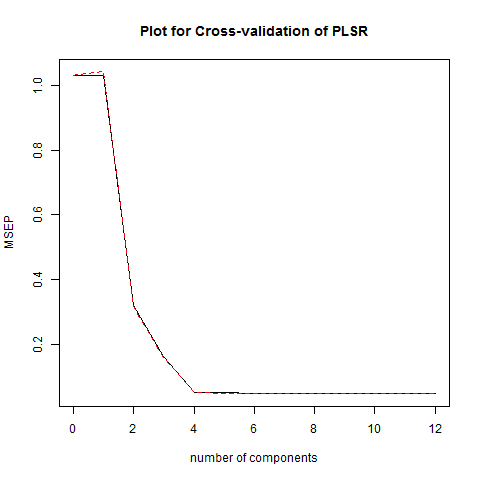

```{r}
knitr::opts_chunk$set(echo = TRUE)
options(xtable.comment = FALSE)
options(knitr.comment = FALSE)
library(glmnet)
library(pls)
```

# 5: Results

    In this section we will compare Principal Components Regression with Partial Least Squares Regression and Lasso Regression with Ridge Regression because of the similarities in each pairwise set of regression methods.
    
## PCR and PLSR

    Below are the plots for cross-validation for PCR and PLSR. They compare the number of components used to the cross-validation MSE (MSEP). 
    
```{r,echo=FALSE,fig.align='center'}
knitr::include_graphics("../../images/scatterplot-pcr.png")

``` 

    How closely the dotted red line fits the solid black line is an indication of how generalizable this regression model is for an arbitrary data set. Informally, it appears as though PCR better matches up the expected error with the training set error compared to PLSR since the lines are further apart for PLSR. However, overall, PLSR appears to minimize error (MSEP) using fewer components than does PCR. The tradeoff between PCR and PLSR is that PLSR requires fewer components to attain a low error, but it is subject to more uncertainty when applied to different data sets.
    
## LR and RR
    