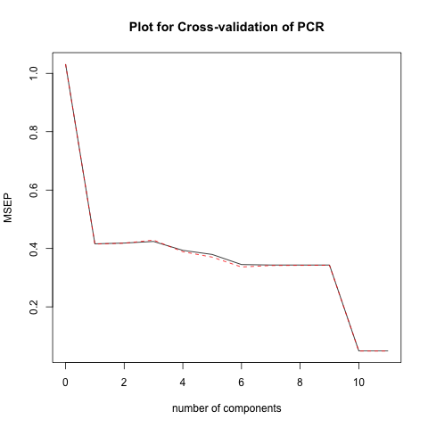

```{r}
knitr::opts_chunk$set(echo = TRUE)
options(xtable.comment = FALSE)
options(knitr.comment = FALSE)
library(glmnet)
library(pls)
```

# 5: Results

    In this section we will compare Principal Components Regression with Partial Least Squares Regression and Lasso Regression with Ridge Regression because of the similarities in each pairwise set of regression methods.
    
## PCR and PLSR
```{r, echo=FALSE, fig.show='hold', fig.width=8} 
op <- par(mfrow=c(1,2)) 

knitr::include_graphics("../../images/scatterplot-plsr.png")
par(op) 
``` 
